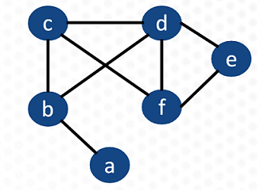

# Cornerstones 2021 - Quantum Annealing

## Day 1 Exercises
The focus of the day 1 exercise is to solidify the problem formulation concepts covered in the lecture. 

### Maximum cut formulation exercise
The slides in the Day 1 folder will guide you through the problem formulation steps. Hints have been 
provided where possible. Feel free to work directly on the powerpoint or PDF.
   
   
## Day 2 Exercises
Day 2 is all about programing and getting familiar with Ocean.

### Ocean installation and set up
To run a problem on D-Wave's quantum computer, you need to install Ocean and
sign up for a Leap account. Leap is only available in certain countries (although
we're working on expanding that list). If you reside outside of a Leap 
supported country you can still install Ocean, but will have to run the
problems on a classical solver.

Before you start these exercises you need to
1. [Sign up for Leap](https://cloud.dwavesys.com/leap/signup) (if in a [supported country](https://support.dwavesys.com/hc/en-us/articles/360051869733-From-What-Countries-Can-I-Access-Leap-))
2. Install the [Ocean SDK](https://docs.ocean.dwavesys.com/en/latest/overview/install.html)

### Set partitioning programming exercise
Once a QUBO is mathematically defined it can be programmatically constructed and solved on
a QPU or hybrid solver. This exercise shows you how to define a QUBO dictionary for a mathematical 
model. You will
1. Add the linear and quadratic biases to the QUBO dictionary
2. Run the problem and observe the results

For reference, see slide 46 in the Intro to QUBOs slide deck

### Maximum cut programming exercise
Now that you have worked through the QUBO formulation in the maximum cut problem,
it's time to program it. In this exercise you will 
1. Build the QUBO dictionary for the maximum cut problem on the graph below 
2. Define a QPU sampler (or classical sampler if you're not in a Leap supported country)
3. Submit the problem to the sampler

Here are some resources to get you started:
* Using the QPU sampler (DWaveSampler): https://docs.ocean.dwavesys.com/en/latest/docs_system/reference/samplers.html#dwavesampler
* Embedding a problem onto the QPU (EmbeddingComposite): https://docs.ocean.dwavesys.com/en/latest/docs_system/reference/composites.html#embeddingcomposite
* Observing a solution with the Inspector (using .show()): https://docs.ocean.dwavesys.com/en/latest/docs_inspector/reference/show.html#functions

For reference see the maximum cut solution slides with the problem formulation